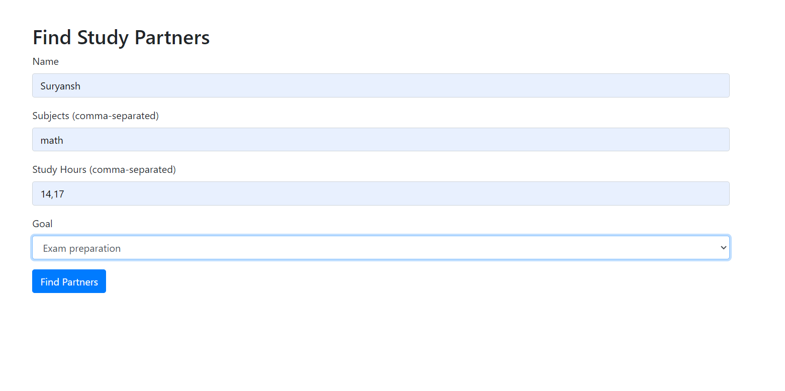
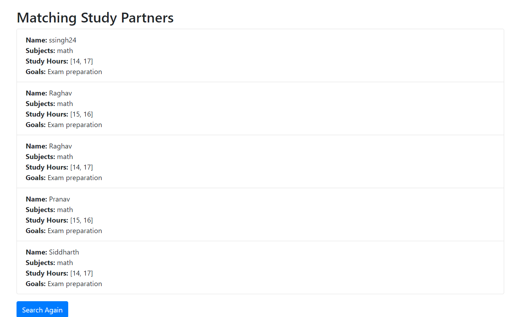

# Student_Matching_platform

This project is a web-based application designed to help students find compatible study partners or groups based on their preferences. By leveraging **K-Means Clustering**, the app organizes students into clusters based on attributes like subjects of interest, study hours, and study goals.

---

## Features

- User-friendly interface using **Flask** and **Bootstrap**.
- Matches students based on compatibility factors using machine learning.
- Scalable and reusable clustering model trained with **K-Means**.
- Dynamically displays matching students based on user input.

---

## Technology Stack

- **Backend**: Python, Flask
- **Frontend**: HTML, CSS, Bootstrap
- **Machine Learning**: K-Means Clustering (from Scikit-learn)
- **Data Handling**: Pandas, NumPy
- **Model Persistence**: Joblib
- **Deployment**: Local Flask server (can be extended to platforms like Heroku or AWS)

---

## Installation
### Prerequisites

- Python 3.8 or higher
- pip (Python package manager)

Follow these steps to set up the project on your local machine:

### 1. Clone the Repository

```bash
git clone https://github.com/your-username/student_matching_platform.git
cd student_matching_platform
```

### 2. Create a Virtual Environment

```bash
python -m venv venv
source venv/bin/activate  # On Windows, use `venv\Scripts\activate`
```

### 3. Install Dependencies

```bash
pip install -r requirements.txt
```

## 4. Usage

1. Prepare a JSON file with student data structured as follows:
    ```json
    [
        {
            "name": "Suryansh",
            "subjects": ["math", "Physics"],
            "study_hours": [10, 12],
            "goals": "Exam preparation"
        },
        
    ]
    ```

2. Run the main script or notebook to train the model:
    ```bash
    python kmeans_model_new.py
    ```

3. View or modify the `find_matching_students()` function to input a new student profile and find matches.


### 5. Prepare the ML Model
Ensure the K-Means model (kmeans_model.pkl), scaler (scaler.pkl), and encoder (mlb.pkl) are trained and available in the project directory.
If you don't have the models, run the training script in the model_training directory (if provided)

### 6. Run the Application
```bash
python appNew.py
```
Open a browser and navigate to http://127.0.0.1:5000/.

---

## Algorithm Used: K-Means Clustering

### Overview

K-Means clustering is an unsupervised learning algorithm used to group similar data points into clusters. For this project:

### Features Used

- **Encoded Subjects**: Transformed using `MultiLabelBinarizer`.
- **Average Study Hours**: Scaled using `StandardScaler`.
- **Study Goals**: Numerically mapped for compatibility.

### Steps

1. **Data Preprocessing**:
   - Encode subjects into numerical format.
   - Scale study hours to normalize the values.
   - Impute missing values to handle incomplete data.

2. **Model Training**:
   - Train the K-Means model with 3 clusters (selected based on experimentation).

3. **Cluster Assignment**:
   - Assign each student to a cluster based on their feature vector.

4. **Matching**:
   - Match new students with others in the same cluster to ensure compatibility.

### Why K-Means?

- **Efficiency**: K-Means is computationally efficient for handling large datasets.
- **Clarity**: It effectively segments students into distinct groups based on the provided features.
- **Simplicity**: The algorithm's simplicity makes it suitable for real-time applications like this project.

---

### Demo

**Home Page:**



**Results Page:**




